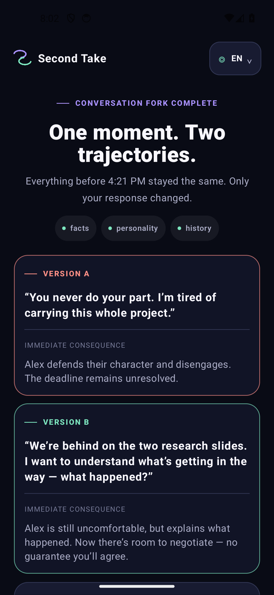
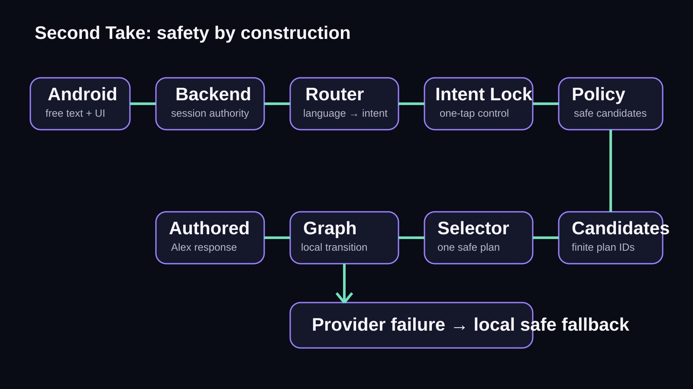
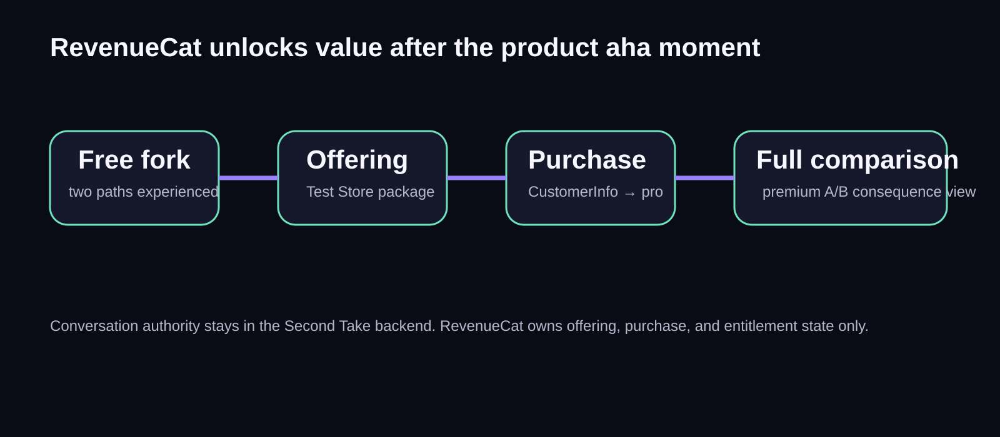

# Second Take

**Rehearse, rewind, and compare.**

Second Take is an Android conversation-rehearsal app for moments that matter because real life rarely gives us a clean second attempt. Talk naturally to Alex, rewind to the exact same conversational checkpoint, make a different choice, and compare how the two paths changed.

Your teammate's slides are late and the presentation is Friday. In the recorded rehearsal, **“I am worried about the project”** gets **“What do you mean exactly?”** Rewind, try **“Can you finish today?”**, and Alex replies **“I can finish the sources by nine tonight.”** Second Take lets you inspect that contrast from a preserved checkpoint. It is a rehearsal, not a prediction of how a real person will respond.



This screenshot shows the published baseline. The comparison-reading refinement described below is on the review branch and is not shown in V5.

## Shipaton 2026 — Next Gen

Second Take is a confirmed **RevenueCat Shipaton 2026 — Next Gen** submission.

- Public demo: [Second Take — One Conversation, A Second Choice](https://www.youtube.com/watch?v=lKjPDNHgfNc)
- Devpost entry: [Second Take](https://devpost.com/software/second-take-kxgcdq)
- Current submission status: [`docs/CURRENT_SUBMISSION_STATUS.md`](docs/CURRENT_SUBMISSION_STATUS.md)
- Current rules audit: [`docs/OFFICIAL_RULES_AUDIT.md`](docs/OFFICIAL_RULES_AUDIT.md)
- Demonstrated-claim boundary: [`docs/FINAL_PRODUCT_CLAIMS.md`](docs/FINAL_PRODUCT_CLAIMS.md)

The demo uses **RevenueCat Test Store**. No real payment or production-store release is claimed.

Reviewing the project? Start with the [short judging guide](docs/JUDGE_REVIEW_GUIDE.md): demo, implementation evidence, provider-free checks, and optional credentialed setup. The [published V5 source](assets/video/second-take-v5-review.mp4) and [media validation](docs/VIDEO_V5_REVIEW.md) identify the 1:41 demo updated on YouTube and the existing Devpost submission on September 21. Earlier edits are archival, not competing submission versions.

## Why it is different

This is not a generic advice chatbot. A **Conversation Fork** preserves the same facts, personality, history, and pre-state across two branches. Only the user's choice changes. The resulting consequences can therefore be compared instead of improvised after the fact.

The free path includes the scenario, natural conversation, Intent Lock where required, one rewind, and the second attempt. RevenueCat unlocks the premium Full A/B Comparison only after the user has experienced both paths.

## How it works



Gemini 3.7 Flash interprets language and selects among conversation moves already approved by a deterministic policy and finite action graph. Gemini never freely writes Alex's final response. Authored utterances realize the selected safe plan. A selector failure can use a deterministic fallback from the safe candidates; a router failure returns an explicit recoverable interruption rather than guessing the user's intention.

Intent Lock gives the user one-tap control over the critical distinction between asking whether Alex *can* do something and asking Alex *to* do it.

## RevenueCat



The Android client uses RevenueCat Android SDK 10.19.1 and the RevenueCat Test Store. Offering `default` exposes package `$rc_monthly`; access is granted only from `CustomerInfo.entitlements["pro"].isActive`. No purchase state is faked locally. The Shipaton Next Gen build transparently discloses that it uses Test Store, not a real charged transaction.

The core conversation, rewind, and second attempt remain usable without Pro access. The entitlement gate applies to **Full A/B Comparison**.

The monetization hypothesis is that reviewing both choices and their immediate responses together has value after the rehearsal. The current single-scenario prototype does not establish recurring willingness to pay; its monthly sandbox price is configuration, not evidence of demand or validated pricing.

### Comparison reading (review branch)

The comparison now pairs each visible reply with a bounded reading: clarification,
an ability statement about sources by nine, or an offer to deliver those sources.
It distinguishes a partial delivery from the whole project. Only exact matches to
24 reviewed English/Portuguese authored replies receive a specific reading; other
replies use a neutral prompt. No model generates these notes, no hidden facts are
read, and no path receives a score. These notes remain behind the real Pro gate.
See [implementation and validation](docs/COMPARISON_READING_2026-09-21.md).
The published V5 predates this UI refinement and is not evidence of the new screen.

## Stack

- Android: Kotlin, Jetpack Compose, Material 3, OkHttp, RevenueCat Android SDK
- Backend: TypeScript, Fastify, Zod, Vitest, Google Gen AI SDK
- AI: Gemini 3.7 Flash through Vertex AI Global, structured output, finite safe candidates

## Run locally

### Provider-free checks

These checks use fakes and do not require Google Cloud or RevenueCat credentials.

macOS/Linux:

```bash
cd backend
npm ci
npm test

cd ../android
./gradlew testDebugUnitTest
```

Windows PowerShell:

```powershell
cd backend
npm ci
npm test

cd ..\android
.\gradlew.bat testDebugUnitTest
```

For the broader backend verification, run `npm run verify`; for Android, run `assembleDebug testDebugUnitTest lintDebug`.

### Backend with Vertex

Requirements: Node.js 22+, Google Cloud CLI, and your own Google Cloud project with Vertex AI enabled.

macOS/Linux:

```bash
gcloud auth application-default login
export VERTEX_PROJECT_ID="your-project-id"
cd backend
npm ci
npm run verify
npm start
```

Windows PowerShell:

```powershell
gcloud auth application-default login
$env:VERTEX_PROJECT_ID = "your-project-id"
cd backend
npm ci
npm run verify
npm start
```

The local service binds to `127.0.0.1:8765`. ADC, OAuth tokens, and credential JSON never belong in this repository.

### Android

Use JDK 17 and Android SDK 35. Start the local backend first. The emulator reaches the host backend at `http://10.0.2.2:8765`; a physical device can use `adb reverse tcp:8765 tcp:8765`.

macOS/Linux:

```bash
cd android
./gradlew assembleDebug testDebugUnitTest lintDebug
```

Windows PowerShell:

```powershell
cd android
.\gradlew.bat assembleDebug testDebugUnitTest lintDebug
```

Optional debug-only values belong in untracked `android/local.properties`:

```properties
SECOND_TAKE_BACKEND_URL=http://10.0.2.2:8765
REVENUECAT_TEST_STORE_API_KEY=test_your_public_sdk_key
```

Configure one RevenueCat Test Store monthly product (`monthly`), entitlement `pro`, offering `default`, and package `$rc_monthly`. See [`docs/REVENUECAT_TEST_STORE_SETUP.md`](docs/REVENUECAT_TEST_STORE_SETUP.md). Release builds deliberately receive no Test Store key.

## Project map

- `android/` — Compose client, tests, and RevenueCat entitlement layer
- `backend/` — local orchestration, graph/policy, resilience, and fake-provider tests
- `docs/` — architecture, data flow, claims, judging, and submission material
- `assets/` — curated diagrams, screenshots, captions, and source recordings

## Privacy and safety

The backend is the conversation authority and keeps hidden facts server-side. The Android client receives only visible state. Operational logs are sanitized by default. See [Privacy and data flow](docs/PRIVACY_AND_DATA_FLOW.md) and [AI architecture](docs/AI_ARCHITECTURE.md).

## Current limits

The MVP contains one polished Alex scenario, uses a local backend, relies on an anonymous RevenueCat user, and uses Test Store rather than a real app-store purchase. The repository does not contain a production backend deployment or production billing configuration. Router outages interrupt a turn; selector outages can activate a safe local fallback. Application deadlines bound the wait, but do not guarantee provider availability or cancel provider billing. A full human TalkBack audit remains future work.

## Roadmap

See [Post-Shipaton roadmap](docs/POST_SHIPATON_ROADMAP.md). Roadmap items are not presented as current features.

## License

MIT. See [LICENSE](LICENSE) and [third-party notices](THIRD_PARTY_NOTICES.md).
